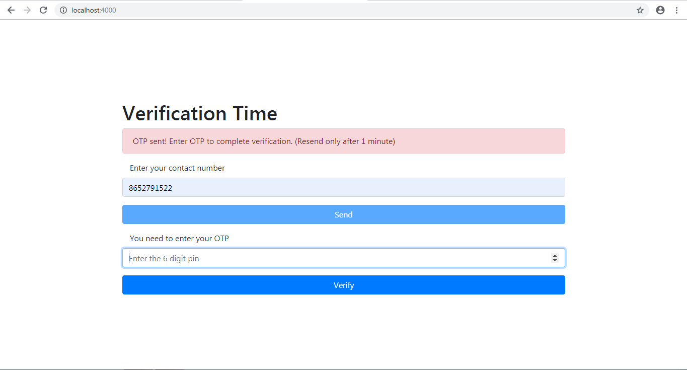
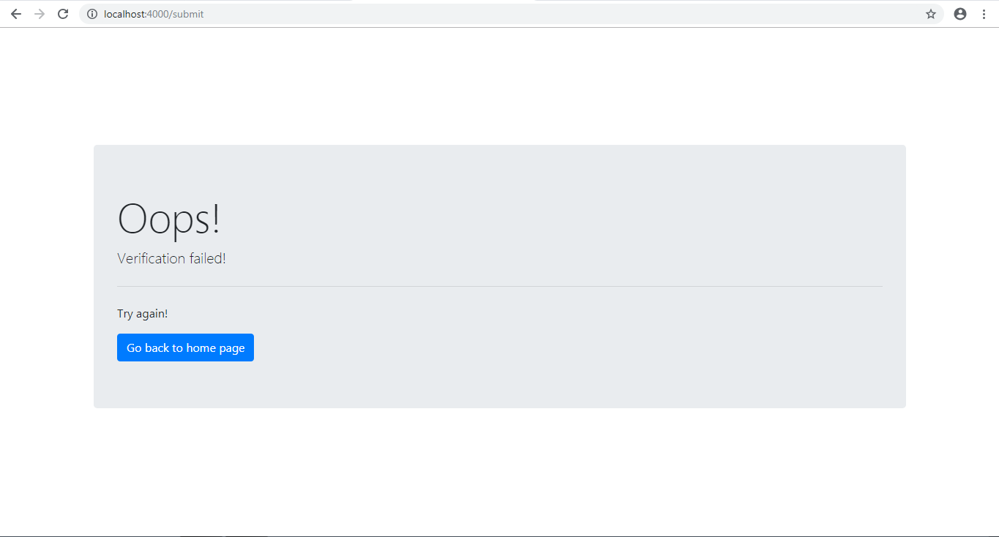

# OTP_Verification
An OTP authentication module for enabling 2 factor authentication. The user receives a One Time Password which is then provided to the application in order to authenticate the user. The application uses nodeJS as the backend along with Bootstrap, jQuery and HTML for developing the frontend.

# Prerequisites

This project uses the following modules:
* body-parser==1.18.3
* ejs==2.6.1
* express==4.16.4
* express-session==1.15.6
* sendotp==1.2.9
* speakeasy==2.0.0

The npm modules can be installed using: 
```
npm install
```

# Installation
Clone the base repository onto your desktop with git as follows
```
$ git clone git@github.com:anuj17singh/OTP_verification
```

# How to run the application on local server?
Run the app.js file using nodemon command
```
nodemon app.js
```
Visit localhost:4000 in your browser

# Images



